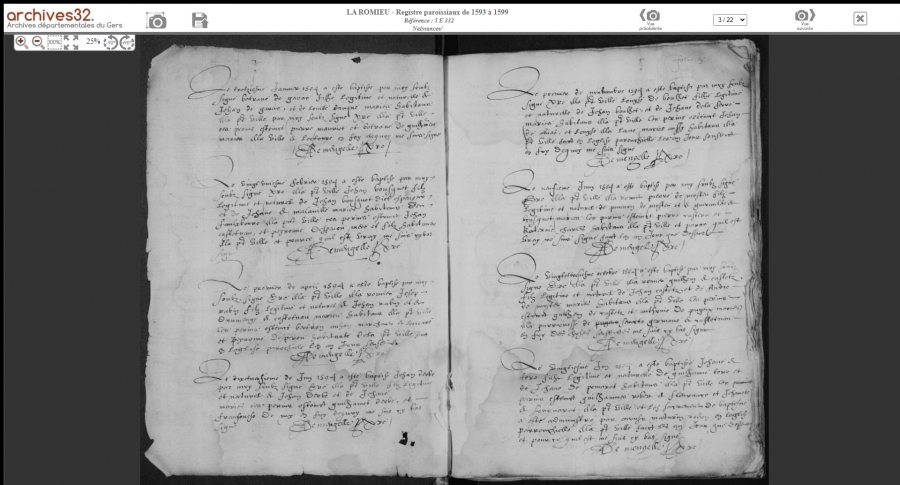
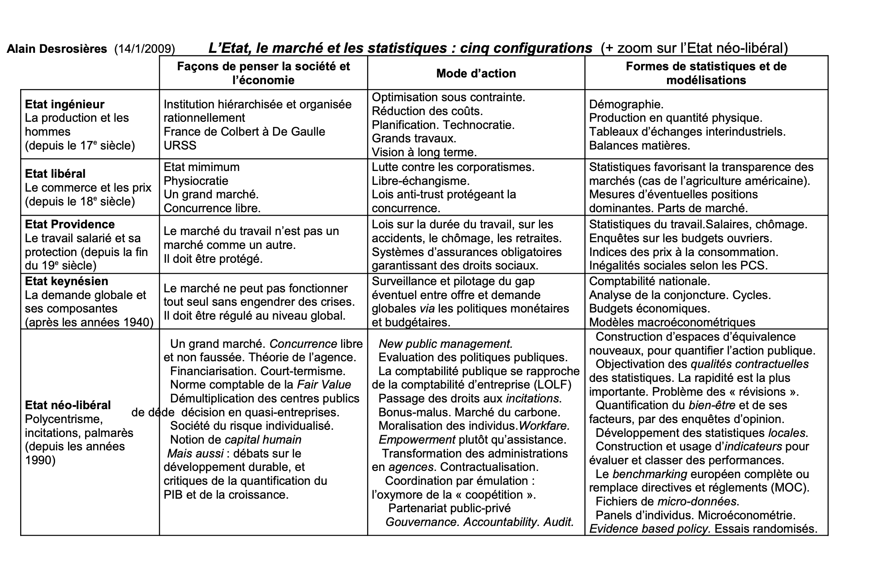
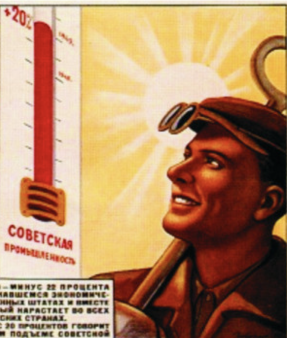
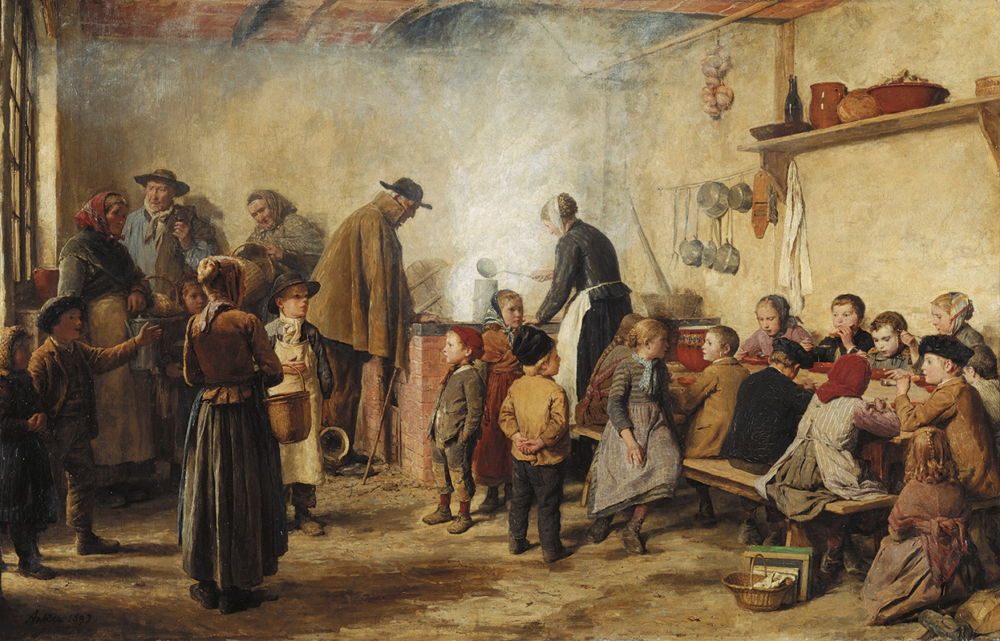

```{r, echo=FALSE}
library(metathis)
meta() %>% 
  meta_description(params$event) %>% 
  meta_name("github-repo" = paste0("datactivist/", params$slug)) %>% 
  meta_viewport() %>% 
  meta_social(
    title = params$title,
    url = paste0("https://datactivist.coop/", params$slug),
    image = params$image,
    image_alt = params$image_alt,
    og_type = "website",
    og_author = "Datactivist",
    og_locale = "fr_FR",
    og_site_name = "Datactivist",
    twitter_card_type = "summary",
    twitter_creator = "@datactivi_st")

```

layout: true

<style>
.remark-slide-number {
  position: inherit;
}

.remark-slide-number .progress-bar-container {
  position: absolute;
  bottom: 0;
  height: 4px;
  display: block;
  left: 0;
  right: 0;
}

.remark-slide-number .progress-bar {
  height: 100%;
  background-color: #e95459;
}

</style>


`r paste0("<div class='my-footer'><span>", params$event, "</span> <center><div class=logo><a href='https://datactivist.coop/'></a></div></center></span></div>")` 


---

class: center, middle

Ces slides en ligne : `r paste0("http://datactivist.coop/", params$slug)`

Sources : `r paste0("https://github.com/datactivist/", params$slug)`


Les productions de Datactivist sont librement réutilisables selon les termes de la licence [Creative Commons 4.0 BY-SA](https://creativecommons.org/licenses/by-sa/4.0/legalcode.fr).

<BR>
<BR>


---
### Qu'attendez-vous de ce cours ?

<iframe allowfullscreen frameborder="0" height="75%" mozallowfullscreen style="min-width: 500px; min-height: 355px" src="https://app.wooclap.com/events/OTKCCA/questions/66d9853361da7535040ce6d0" width="100%"></iframe>


---

### .red[Objectifs] du cours

* Comprendre le rôle de la quantification dans la construction de l'expertise 

* Comprendre les conditions de fiabilité d'une donnée dans une optique de plaidoyer

* Sélectionner les données pour faire passer les bons messages

* Traduire les données en langage visuel avec la dataviz 

.footnote[Dans le cadre de ce cours, nous travaillerons sur des données **agrégées** plutôt que sur des données **brutes**. Je propose un cours de _data journalism_ pour les étudiants du M2 Métiers de l'Information.]

---
### Contenu des séances

1. **05/09 :** Sociohistoire de la statistique (**vous êtes ici !**)

2. **12/09 :** La construction sociale des chiffres

3. **19/09** : Les acteurs de la statistique et de la quantification

4. **26/09 :** Collecter et évaluer les chiffres

5. **24/10 :**Visualiser les données


---
### Modalités d'évaluation

.pull-left[
La moitié de la note sera constituée d'une note de groupes. Vous devrez rédiger un **Position papper** contenant : 
- **des chiffres clés sourcés ** : vous serez évalués sur la qualité et la diversité des sources que vous décrirez dans une notice méthodologique
- **une infographie** qui fait passer des messages clés avec des chiffres et de la visualisation de données

Ce travail sera réalisé en groupes et aligné avec le BWS. .red[**Plus d'infos lors de la prochaine séance.**]

Prochaine séance : choisir une thématique et constituer les groupes
3 : messages à faire passer
4 : identifier les données
5 : visualiser les chiffres 
]

.pull-right[

L'autre moitié sera une **note individuelle** réalisée à partir d'un QCM administré par Equinox sur le contenu de la séance précédente.   
]
---
class:middle, center, inverse

## Strategic data ? 

---
### Au fait, c'est quoi une donnée selon vous ? 

<iframe allowfullscreen frameborder="0" height="70%" mozallowfullscreen style="min-width: 500px; min-height: 355px" src="https://app.wooclap.com/events/OTKCCA/questions/66d989183e0a5927938edaba" width="100%"></iframe>

---
### Une définition des données

.pull-left[
Proposée par Rob Kitchin dans _The Data Revolution_

]

.pull-right[
>   Les données sont généralement comprises comme étant **la matière première produite par la synthèse du monde en catégories, mesures et autres formes de représentation** - nombres, caractères, symboles, images, sons, ondes électromagnétiques, bits - qui constituent **les éléments de base à partir desquels l'information et le savoir sont créés**.

]
---
### Et c'est quoi la quantification ? 

<iframe allowfullscreen frameborder="0" height="70%" mozallowfullscreen style="min-width: 500px; min-height: 355px" src="https://app.wooclap.com/events/OTKCCA/questions/66d9a88600372c2407b77edd" width="100%"></iframe>

---
### Une définition de la .red[quantification]

.pull-left-narrow[


]

.pull-right-wide[

> La **quantification**, c’est-à-dire l’action de quantifier, correspond au processus social de mise en nombres d’une réalité

> le terme « quantification » regroupe donc toutes les étapes (catégorisation, collecte des données, techniques mathématiques…) qui visent à créer un chiffre à partir d’une réalité physique ou sociale, c’est-à-dire à attribuer à celle-ci une grandeur mesurable. 
 
]

.footnote[Anaïs Henneguelle et Arthur Jatteau, _Sociologie de la quantification_,
La Découverte, 2021.]

---
### .red[La commensurabilité] : mesurer pour comparer

> Il est fortement lié à celui de « commensurabilité » : par la mise en chiffres, la quantification permet de rendre comparables des réalités sociales qui ne le sont pas de prime abord à partir d’une métrique commune [Espeland et Stevens, 1998]. 

#### La quantification a souvent pour but direct ou indirect la comparaison.

.footnote[Anaïs Henneguelle et Arthur Jatteau, _Sociologie de la quantification_,
La Découverte, 2021.]

---
### Et la .red[statistique] ?

<iframe allowfullscreen frameborder="0" height="75%" mozallowfullscreen style="min-width: 500px; min-height: 355px" src="https://app.wooclap.com/events/OTKCCA/questions/66d9bbfa085c39b185637e59" width="100%"></iframe>
---
### Statistique, indicateur et mesure 


- **« statistique »** : le recueil d’un ensemble important de données et leur traitement par des méthodes spécifiques pour pouvoir les résumer en peu d’informations (comme le calcul d’une moyenne, par exemple)

- **« indicateur »** : il sous-entend que l’on cherche à se renseigner sur une réalité physique, économique ou sociale à partir d’éléments chiffrés. L’indicateur est donc plus qu’une statistique, puisqu’il permet d’évaluer une situation selon une dimension particulière (celle qui est mise en avant) et sert souvent d’aide à la décision. Il permet donc de décrire, mais aussi, et peut-être surtout, d’agir.

- **« mesure »** : renvoie à l’évaluation d’une grandeur ou d’une quantité, souvent en référence ou en comparaison à une autre de même espèce (qualifiée d’« étalon de mesure »). Plus souvent associé à des grandeurs physiques. 

.footnote[Anaïs Henneguelle et Arthur Jatteau, _Sociologie de la quantification_,
La Découverte, 2021.]

---
### Pourquoi les données sont-elles stratégiques ?
 
<iframe allowfullscreen frameborder="0" height="70%" mozallowfullscreen style="min-width: 500px; min-height: 355px" src="https://app.wooclap.com/events/STRATDATA/questions/66d9a9a71e81bbf1152f5e07" width="100%"></iframe>

---
### Des chiffres pour faire tenir les choses 

.pull-left[


]
.pull-right[
Pour Alain Desrosières, dans _La Politique des grands nombres_ (p.27), la statistique vise à : 
> "**faire tenir les choses**, de façon à ce qu'elles constituent des représentations partagées, sur lesquelles des actions dotées de sens commun puissent porter.
]

Les chiffres permettent de "**dire et faire société**" grâce à leur réputation de **factualité et d'objectivité**". 

Ils fournissent des "**points d'appui**" à la réflexion et au débat. 
---

### La quantification construit et transforme le monde social 

Pour Alain Desrosières, **le chiffre est .red[performatif] : il engendre des effets par le fait même d’exister, d’être énoncé.**

Alors que la statistique a longtemps été perçue comme un instrument neutre, dont la croissance serait inéluctable, il montre que s’entremêlent : 
.red[1. des façons de penser la société et l'économie
2. des modes d'action publique
3. des formes de statistiques et de traitement de celles-ci.]

La quantification continue de prendre de l'ampleur dans la société néolibérale par : 
- **le big data :** les bases de données massives et la croissance du volume de données collectées.
- **le reporting généralisé :** la nécessité accrue, pour les entreprises et les administrations, de rendre compte de leurs actions, par des indicateurs statistiques (exemple : rapport RSE).

---
class: inverse, center, middle

# Quelques repères historiques

---
### La tablette mésopotanienne : inscrire une réalité complexe
Vers 3200 av. J.-C., en Mésopotamie, la civilisation sumérienne a inventé l’écriture d'abord pour mémoriser des comptes.


.pull-left[

]

.pull-right[
>Arbres et têtes de bétails sont classés pour être comptabilisés. On a bien affaire ici à des données.
]

---
### La préhistoire de la quantification
On trouve des **traces de la quantification** dans de nombreux grands empires de l'Antiquité (en Mésopotamie, en Chine, en Egypte, en Inde, en Grèce…) Des listes d’esclaves, de biens ou encore d’individus étaient produites pour déterminer la conscription, la répartition des terres, la fiscalité… 

Ces recensements constituent plutôt l’exception que la règle. 
> Les « chiffres » n’occupent pas une place centrale dans la vie politique, économique et sociale, d’abord parce que les moyens techniques et scientifiques de collecte et d’interprétation des données ne sont guère disponibles, mais surtout parce que les besoins ne se font que très faiblement sentir.

.footnote[Anaïs Henneguelle et Arthur Jatteau, _Sociologie de la quantification_,
La Découverte, 2021.]

---
### L'interdit biblique du dénombrement
Plusieurs passages de l'Ancien testament mentionnent cet interdit : le dénombrement des individus pourrait attirer le malheur ou la colère divine. 
.red[
>  le dénombrement représente par excellence le savoir divin par sa capacité à saisir d’un seul mouvement le tout et le détail et à ouvrir ainsi sur la perspective d’une maîtrise absolue.

> […] Cet orgueil consiste aussi à croire que la puissance – entre autre, militaire – d’Israël dépend du nombre de ses hommes, et non de la seule main de Dieu. Recenser signifie croire qu’on peut agir sur la seule base de ses propres forces disponibles ; croire qu’on maîtrise le cours des événements par la connaissance objective du tout et du détail du réel. 
]

Solution ? Réaliser des comptages indirects, en comptant les pièces plutôt que les personnes elles-mêmes. 

.footnote[BERNS, T (2009). 11. David :Gouverner sans gouverner Une archéologie politique de la statistique. Presses Universitaires de France, pp. 117-129.]

---


.pull-left[


.footnote[Asterix chez les pictes, © Albert René 2013]
]
.pull-right[
### La figure du censeur à Rome
Le censeur est un magistrat romain qui dresse le **recensement quinquennal des citoyens romains** (_census_) par niveau de fortune. Ils dressent l’_album_ sénatorial, c'est-à-dire le registre des personnes admises au Sénat.

**Surveillent les mœurs** : ils peuvent rayer de l’album sénatorial les sénateurs indignes, mais aussi attaquer publiquement la réputation d’une personne par la _nota censoria_.

Autre rôle :  **administrateur de la fortune publique**. Ils surveillent la collecte des impôts et attribuent les marchés de travaux publics.

]

---
### L'émergence de l'état civil au Moyen-Age

.pull-left[
A la même époque, au Royaume-Uni (1538) et en France (1539) avec l'édit de Villar, les registres paroissiaux sont rendus obligatoires pour enregistrer les **baptêmes, mariages et enterrements**.

Pour Desrosières dans _La Politique des grands nombres_, ce souci de la stabilité de l'identité des personnes est un "**acte fondateur de la statistique moderne**". Il permet de fixer des unités définies et stables.
]

.pull-right[

]


---
### Exemple de .red[registres paroissiaux]



.footnote[Archives départementales du Gers]

---
### .red[La "Statistik" allemande] : naissance d'une science de l'Etat

Le terme "statistiques" est né en Allemagne pour désigner une "**science de l'Etat**". Contexte : Allemagne morcelée en 300 micro-Etats en rivalité. 

La statistique est « une description de l’État par lui-même et pour lui-même » dans une tradition littéraire qui **n’utilise pas de chiffres**, ni de tableaux.

Elle désigne un "**mode de pensée**" qui ambitionne de compréhendre les communautés humaines comme un tout articulant articulant une série de traits permettant de caractériser l’État, son climat, ses ressources naturelles ou encore sa population.

---
### .red[Les "statistics" anglaises] : naissance de l'expertise
.pull-left[
A la fin du XVIIe siècle, alors que la société prend une forme d'autonomie par rapport au monarque, naissent des techniques d'enregistrement et de calcul désignées comme ".red[**arithmétique politique**]."
> "L'art de raisonner par des chiffres sur des objets relatifs au gouvernement." (Davenant)


Ces premiers "statisticiens" sont extérieurs au monde universitaire. 
]

.pull-right[

**Rôle social nouveau de l'expert** qui "_propose des techniques aux gouvernants en essayant de les convaincre que, pour réaliser leurs dessins, ils doivent passer par lui._"


3 moments importants de l'arithmétique politique : 
1. Tenue de registres 
2. Dépouillement et totalisation
3. Interprétation en terme de poids, nombres et mesures

Forment des hypothèses d'uniformité du territoire, ancêtre des sondages aléatoires.
]

--

---
class: inverse, center, middle

# 5 formes d'articulation entre l'Etat, le marché et les statistiques

---
5 configurations jugées typiques qui ne correspodent pas à une succession historique et sont souvent entremelées dans les situations : 



---
### L'Etat ingénieur : statistiques de démographie et de production


.left-column[

]


.right-column[
> L'intervention directe englobe des perspectives variées, allant du mercantilisme et du colbertisme (17ème siècle) jusqu'aux économies planifiées socialistes : l'Etat ingénieur à la française est une de ses modalités (…). Ses statistiques y sont comparables à celles d’une grande entreprise planifiant ses ateliers, ou à celles d’une armée gérant sa logistique. Les recensements démographiques et les flux de produits en quantité physique y sont essentiels.
]

---
### L'Etat libéral : faire fonctionner le marché


.left-column[

.footnote[[Geographica](https://geographica.net/2013/04/chicago-le-lieu-de-la-jungle/)]
]


.right-column[
> l’Etat libéral classique (fin du 18ème siècle) réduit au minimum cette intervention et prône la libération des forces du marché. Les statistiques, si elles existent, visent à rapprocher les marchés réels de ceux de la théorie (information complète et identique pour tous les acteurs), notamment en matière de prix. Les enquêtes agricoles menées aux Etats-Unis depuis plus d’un siècle en sont un prototype. Le rêve d’une société « libérale-libertaire » sans Etat, fondée sur les seuls mécanismes du marché, où les prix intègreraient toute l’information nécessaire, est le symétrique du rêve précédent d’un pur Etat ingénieur.
]

---
### L'Etat providence : protéger les travailleurs

.left-column[

.footnote[[histoiredelasecuritesociale.ch](https://www.histoiredelasecuritesociale.ch/synthese/1850-1890-lassistance-aux-pauvres)]
]


.right-column[
> L'Etat providence (fin du 19ème siècle) cherche à protéger les travailleurs salariés des conséquences de l'extension de la logique marchande au travail lui-même, en mettant en place les systèmes de protection pour le chômage, les accidents du travail, la maladie, la famille. Ses instruments sont notamment les enquêtes par sondage sur l’emploi, sur les besoins, les revenus et les budgets de famille des travailleurs, ainsi que les indices de prix des consommations de ceux-ci.
]


---
### L'Etat keynésien : réguler le marché

.left-column[


]


.right-column[
> -Le keynésianisme assigne à l'Etat une responsabilité dans le pilotage macroéconomique d'une société dont le caractère marchand n'est cependant pas contesté (années 1930). La comptabilité nationale est son instrument central (Vanoli 2002). Les systèmes statistiques publics sont réorganisés pour les besoins de celle-ci. La consommation et l’indice des prix quantifiant l’inflation concernent toute la population et non plus les seuls travailleurs manuels. Les modèles macroéconométriques, comme ceux de Ragnar Frisch, Jan Tinbergen ou Lawrence Klein, orientent des politiques portant sur des agrégats, en confrontant offre et demande globale.

]


---
.left-column[
### L'Etat néo-libéral : évaluer, classer, inciter


]


.right-column[
> -Enfin l’Etat néo-libéral prend appui sur les dynamiques microéconomiques, en les orientant éventuellement par des systèmes d'incitations et en acceptant les principales hypothèses de la théorie des anticipations rationnelles (années 1980). Le benchmarking, c’est à dire l’évaluation, le classement et le palmarès des performances, en est un instrument essentiel. Les modèles microéconométriques de régression logistique permettent de séparer et d’isoler les « effets propres » de variables ou d’outils de l’action publique sur les performances de ceux-ci, en vue d’améliorer les « variables cibles » de politiques pensées en termes d’incitations (notamment fiscales) et de comportements individuels. L’émulation suscitée entre les outils permet de dégager les « meilleures pratiques ».


]

---


class: inverse, center, middle

# Merci !

Contact : [joel@datactivist.coop](mailto:joel@datactivist.coop)


