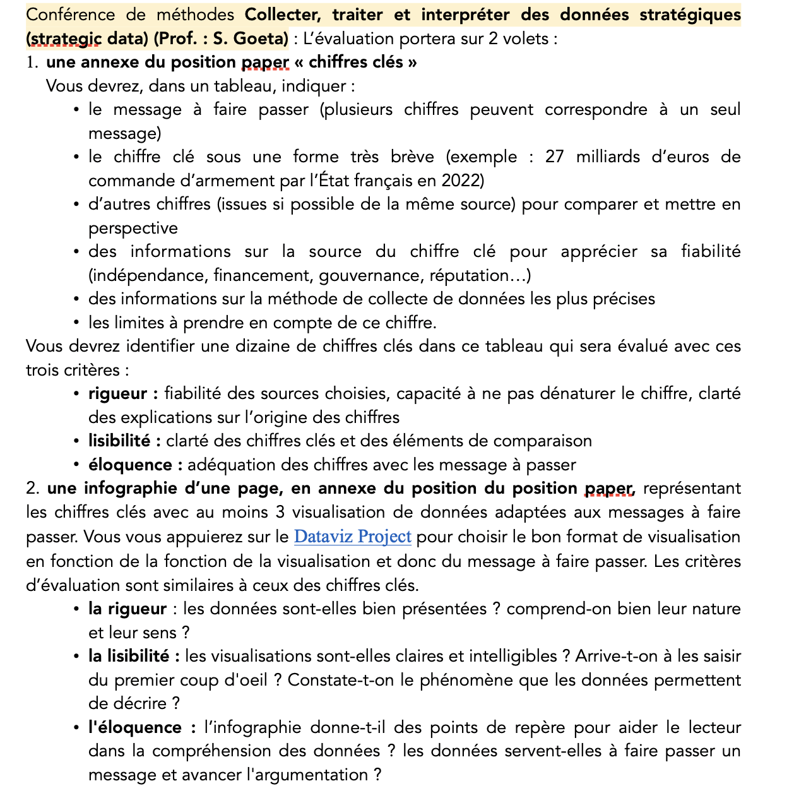
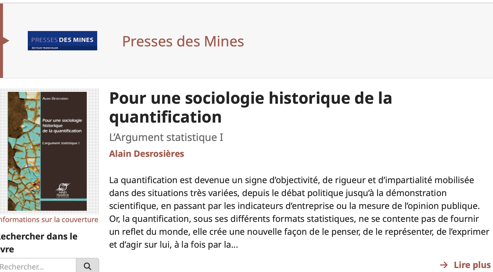
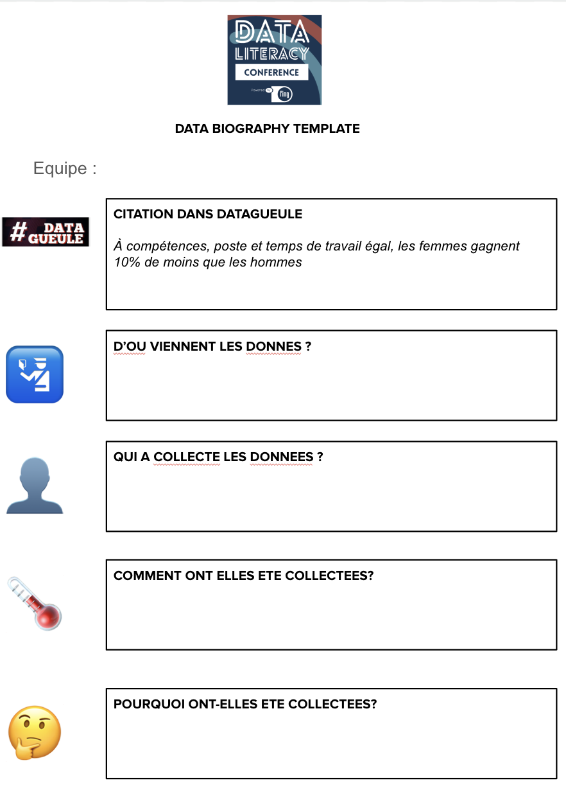

```{r, echo=FALSE}
library(metathis)
meta() %>% 
  meta_description(params$event) %>% 
  meta_name("github-repo" = paste0("datactivist/", params$slug)) %>% 
  meta_viewport() %>% 
  meta_social(
    title = params$title,
    url = paste0("https://datactivist.coop/", params$slug),
    image = params$image,
    image_alt = params$image_alt,
    og_type = "website",
    og_author = "Datactivist",
    og_locale = "fr_FR",
    og_site_name = "Datactivist",
    twitter_card_type = "summary",
    twitter_creator = "@datactivi_st")

```

layout: true

<style>
.remark-slide-number {
  position: inherit;
}

.remark-slide-number .progress-bar-container {
  position: absolute;
  bottom: 0;
  height: 4px;
  display: block;
  left: 0;
  right: 0;
}

.remark-slide-number .progress-bar {
  height: 100%;
  background-color: #e95459;
}

</style>


`r paste0("<div class='my-footer'><span>", params$event, "</span> <center><div class=logo><a href='https://datactivist.coop/'></a></div></center></span></div>")` 


---

class: center, middle

Ces slides en ligne : `r paste0("http://datactivist.coop/", params$slug)`

Sources : `r paste0("https://github.com/datactivist/", params$slug)`


Les productions de Datactivist sont librement réutilisables selon les termes de la licence [Creative Commons 4.0 BY-SA](https://creativecommons.org/licenses/by-sa/4.0/legalcode.fr).

<BR>
<BR>


---
class:inverse, middle, center

### C'est l'heure du .red[QCM] 😬

### Rdv sur Equinox

**Pour y accéder :** 
> Masters

> Enseignements de master par disciplines

> Science politique

> Collecter, traiter et interpreter des donnees strategiques (strategic data)

**10 minutes, 8 questions**

**Aucune tricherie ne sera tolérée.**
---
### Précision sur les modalités d'évaluation : le .red[position paper]

.left-column[
.red[Consignes et critères d'évaluation sur Equinox :]



]

.right-column[
2 cas de figure possibles : 
1. **Vous participez au BWS, vous produisez un position paper :** votre équipe réalise un position paper et les réalisations figurent en annexe. Il faudra aussi s'en servir dans le corps du position paper.

2. **Vous participez au BWS, vous n'avez pas de position paper :** vous produisez un tableau "chiffres clés" et une infographie en lien avec votre rôle sans produire un position paper pour autant. 

3. **Vous ne participez pas au BWS, vous créez une situation fictive :** vous choisissez une organisation (ONG, lobby, institution, syndicat, interprofession), un projet de loi ou directive réel en cours de débat, la position l’organisation à propos du projet de législation, les demandes de l’organisation. Vous pouvez (et c'est encouragé) vous appuyez sur des prises de position réelles d'organisation. Cela doit tenir en 2 pages maximum. 
]

---
### La statistique comme outil de gouvernement et outil de preuve

.pull-left[
#### Extrait 1

.footnote[Alain Desrosières, _Pour une sociologie historique de la quantification_, Presses des Mines, 2008.]

]

.pull-right[
Questions :

* Quel est le lien avec les deux origines de la statistique ?

* Avez-vous des exemples de la statistique comme outil de gouvernement et outil de preuve ?
]


---

### La statistique comme outil de gouvernement et outil de preuve

.pull-left[
.red[**Outil de gouvernement**]

- Informer la population et les acteurs

- Organiser l'allocation des ressources

- Prendre des décisions

- Fournir des points de repère

]

.pull-right[
.red[**Outil de preuve**]

- Etablir des arguments et des positions dans une controverse

- Trancher des discussions

- Légitimer une démonstration

- Renforcer une décision par une présomption d'objectivité

]

Les deux dimensions de la statistique sont liées : la statistique sert d'outil scientifique en même temps d'outil politique.

.footnote[Anaïs Henneguelle et Arthur Jatteau, _Sociologie de la quantification_,
La Découverte, 2021.]
---
### Statistique et réalité : deux approches


.pull-left[
#### Extrait 1

.footnote[Alain Desrosières, _Pour une sociologie historique de la quantification_, Presses des Mines, 2008.]

]

.pull-right[
Questions :

* Selon le modèle réaliste, qu'est-ce qu'une "erreur" de mesure ? Qu'est-ce que cela implique sur
l'existence d'une réalité à mesurer ?

* Selon le modèle conventionnaliste, pourquoi ne peut-on pas séparer la mesure des conventions
qui la fondent ?
]


---
### Statistique et réalité : deux approches

.pull-left[
.red[**L'approche réaliste**]
- Statistique : historiquement construite et légitimée à partir des sciences de la nature. 

- Supposer qu'il préexiste une réalité antérieurement à sa mesure.

- Chômage, pauvreté et bonheur sont des réalités et on peut les mesurer.

- Il peut exister des biais dans la "mesure" mais cela signifie qu'il existerait une réalité qu'on pourrait mesurer (un "vrai" chiffre du chômage)

]

--
.pull-right[
.red[**L'approche constructiviste**]
- Historiquement : provient des sciences sociales

- Place centrale aux conventions qui ont nécessairement présidé la construction des chiffres

- Conventions d'équivalence : s'accorder sur le fait qu'il est pertinent, dans un certain cadre (Pôle Emploi, Insee…), de comptabiliser comme "chomeur" des individus aux situations différentes. 

- Garder la trace du codage pour ne tomber dans le piège de la réification des chiffres
]

---


.left-column[
### Quantifier, c'est convenir puis mesurer


]

.right-column[
> Le verbe quantifier est employé ici dans un sens large : **exprimer et faire exister sous une forme numérique ce qui, auparavant, était exprimé par des mots et non par des nombres.** […]

>  Le verbe quantifier, dans sa forme active (faire du nombre), suppose que soit **élaborée et explicitée une série de conventions d’équivalences préalables**, impliquant des comparaisons, des
négociations, des compromis, des traductions, des inscriptions, des codages, des procédures
codifiées et réplicables, et des calculs conduisant à la mise en nombre. 

> La mesure proprement dite vient ensuite, comme mise en œuvre réglée de ces conventions. De ce point de vue, **la quantification se décompose en deux moments : convenir et mesurer**. 
]

---
### Vos exemples de conventions statistiques
https://app.wooclap.com/STRATDATA2
<iframe allowfullscreen frameborder="0" height="70%" mozallowfullscreen style="min-width: 500px; min-height: 355px" src="https://app.wooclap.com/events/SAXBFP/questions/66e308a44b846c9b45e93131" width="100%"></iframe>

---
### Les définitions de l'INSEE 

[](https://www.insee.fr/fr/metadonnees/definitions)

---
### Une convention n'est jamais figée

<iframe width="560" height="415" src="https://www.youtube.com/embed/k2CejlPnqsQ?si=gKkhgoQBe_NQ4ed0" title="YouTube video player" frameborder="0" allow="accelerometer; autoplay; clipboard-write; encrypted-media; gyroscope; picture-in-picture; web-share" referrerpolicy="strict-origin-when-cross-origin" allowfullscreen></iframe>
---
### La réification des objets statistiques 


.pull-left[
#### Extrait 1

.footnote[Alain Desrosières, _Pour une sociologie historique de la quantification_, Presses des Mines, 2008.]

]

.pull-right[
Questions :

* Avez-vous des exemples de conventions oubliées ou routinisées ?

* Exemples de controverses dans lesquelles ces conventions ont été rouvertes?
]

---
### La réification des objets statistiques

> Une fois les procédures de quantification codifiées et routinisées, leurs produits sont réifiés. Ils tendent à devenir « la réalité », par un effet de cliquet irréversible. Les conventions initiales sont oubliées, l’objet quantifié est comme naturalisé et l’emploi du verbe « mesurer » vient machinalement à l’esprit et sous la plume. 

> Cela reste vrai jusqu’à ce que, pour des raisons à analyser au cas par cas, ces « boîtes noires » sont réouvertes, à l’occasion de controverses.

.footnote[Desrosières, Alain. Pour une sociologie historique de la quantification. Presses des Mines, 2008, https://doi-org.lama.univ-amu.fr/10.4000/books.pressesmines.901.
]


---
### Inverser l'infrastructure pour ouvrir la boite noire de la statistique

.left-column[


Bowker & Star, _Sorting Things Out: Classification and Its Consequences_, MIT Press, 2000.
]
.right-column[
> _This inversion is a struggle against the tendency of infrastructure to disappear (except when breaking down). It means learning to look closely at technologies and arrangements that, by design and by habit, tend to fade into the woodwork (sometimes literally!)._

> _Infrastructural inversion means recognizing the depths of interdependence of technical networks and standards, on the one hand, and the real work of politics and knowledge production on the others_
]
---
class: inverse

### .red[Exercice :] la data biographie

.pull-left[
Refaire la biographie d'un chiffre à partir d'un épisode de Datagueule :


]

.pull-right[

]
---
class: inverse, center, middle

# Merci !

Contact : [samuel.goeta@sciencespo-aix.fr](mailto:samuel.goeta@sciencespo-aix.fr)


