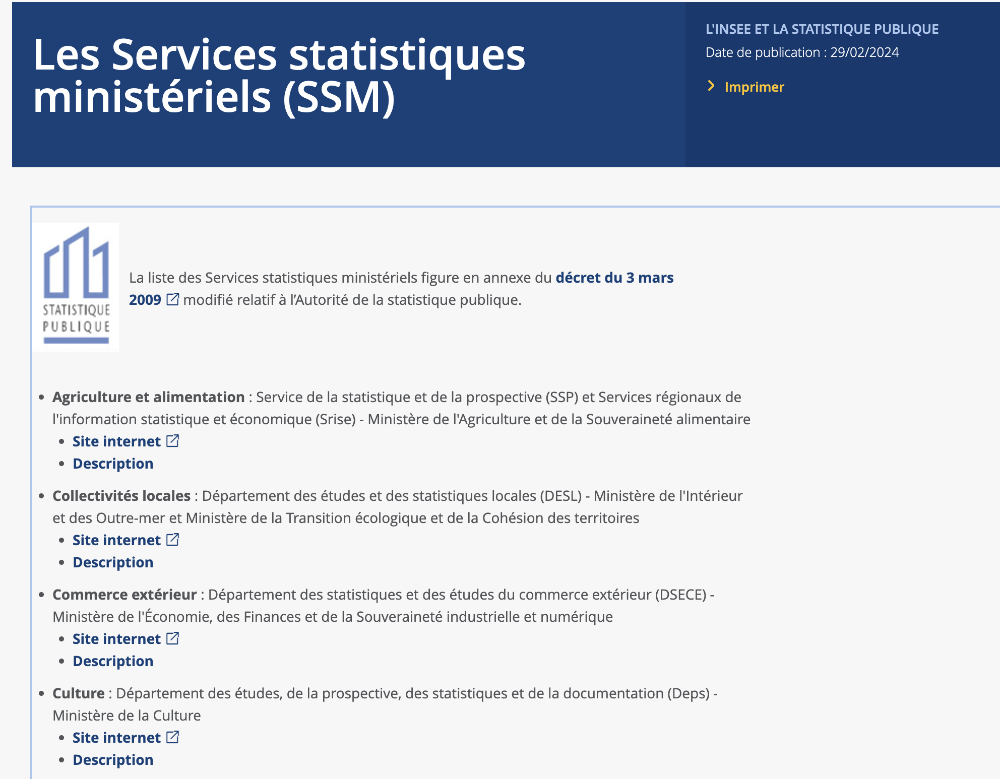
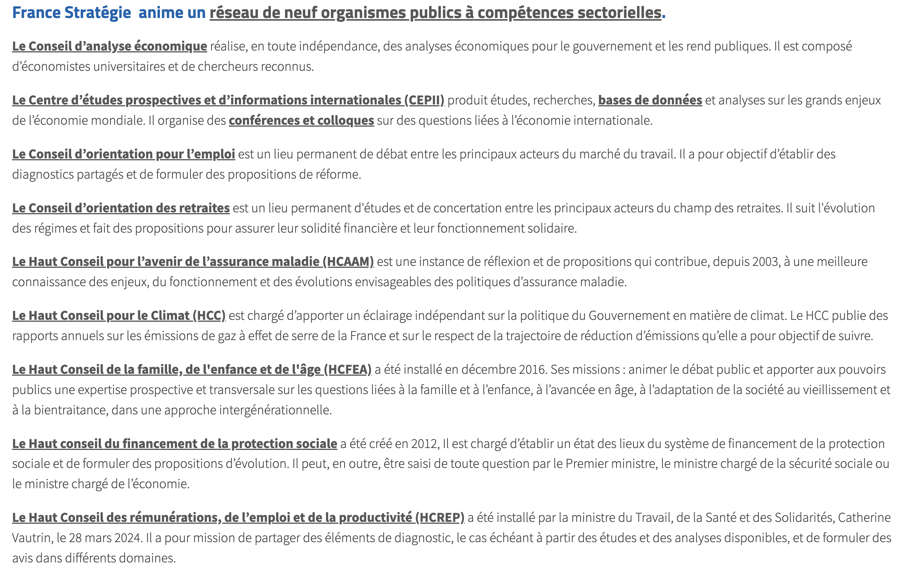
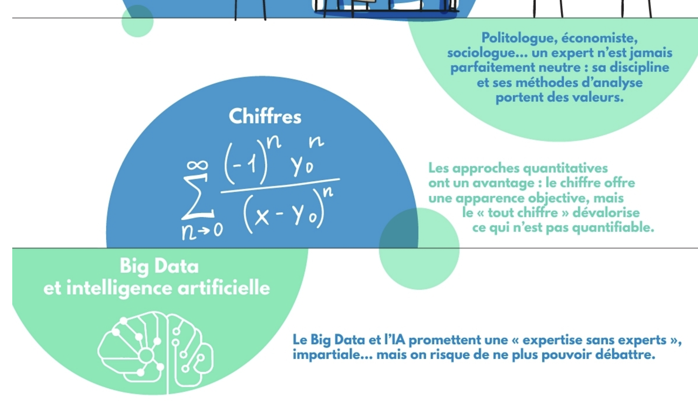

```{r, echo=FALSE}
library(metathis)
meta() %>% 
  meta_description(params$event) %>% 
  meta_name("github-repo" = paste0("datactivist/", params$slug)) %>% 
  meta_viewport() %>% 
  meta_social(
    title = params$title,
    url = paste0("https://datactivist.coop/", params$slug),
    image = params$image,
    image_alt = params$image_alt,
    og_type = "website",
    og_author = "Datactivist",
    og_locale = "fr_FR",
    og_site_name = "Datactivist",
    twitter_card_type = "summary",
    twitter_creator = "@datactivi_st")

```

layout: true

<style>
.remark-slide-number {
  position: inherit;
}

.remark-slide-number .progress-bar-container {
  position: absolute;
  bottom: 0;
  height: 4px;
  display: block;
  left: 0;
  right: 0;
}

.remark-slide-number .progress-bar {
  height: 100%;
  background-color: #e95459;
}

</style>


`r paste0("<div class='my-footer'><span>", params$event, "</span> <center><div class=logo><a href='https://datactivist.coop/'></a></div></center></span></div>")` 


---

class: center, middle

Ces slides en ligne : `r paste0("http://datactivist.coop/", params$slug)`

Sources : `r paste0("https://github.com/datactivist/", params$slug)`


Les productions de Datactivist sont librement réutilisables selon les termes de la licence [Creative Commons 4.0 BY-SA](https://creativecommons.org/licenses/by-sa/4.0/legalcode.fr).

<BR>
<BR>


---
class:inverse,middle,center

# Retour sur les [data biographies](https://docs.google.com/presentation/d/1ZKirAT6zelcBeDhYs2fa83S5y_03-yZvsDaXSEWOYxU/edit?pli=1#slide=id.g2ffa2576c2b_21_0)

---
### Les acteurs de la quantification : à quoi pensez-vous ?

<iframe allowfullscreen frameborder="0" height="100%" mozallowfullscreen style="min-width: 500px; min-height: 400px" src="https://app.wooclap.com/events/ULIBGT/questions/66f62b87f0ec75548a86487a" width="100%"></iframe>
---
### Les acteurs de la quantification

.pull-left[
En cercle concentriques : 

* L'INSEE et le service statistique ministériel

* L'expertise publique

* Les sondeurs

* Les think tank 

* L'analyse de l'opinion par la donnée

]

.pull-right[


]
---
### Rappel : les 5 configurations de Desrosières


---
### Avant la création de l'INSEE (1/3)


* En 1800, Lucien Bonaparte crée un Bureau de statistique qui organise le premier recensement général de la population en 1801, supprimé en 1812.

* 1833, Adolphe Thiers propose la création, au ministère du Commerce, d'un Bureau de statistique générale, qui prend en 1840 le nom qu'il gardera pendant un siècle : Statistique générale de la France (SGF).

* 1936 : SGF devient un service du ministère de l'Économie 

* 1941 : création du Service national des statistiques (SNS) au sein du ministère des Finances. 
René Carmille : développement de la **mécanographie et de l'exploitation des fichiers administratifs**, création du **corps d'administrateurs**, d'attachés et de commis. Arrêté à Lyon en 1944 pour faits de résistance, René Carmille meurt à Dachau le 26 janvier 1945.

.footnote["Un peu d'histoire", INSEE. [Source](https://www.insee.fr/fr/information/1300622)]

---
### Un documentaire sur René Carmille

<iframe width="760" height="500" src="https://www.youtube.com/embed/IxYg3tdHTY0?si=ZDoFTgO3jn1LrCtW&amp;start=736" title="YouTube video player" frameborder="0" allow="accelerometer; autoplay; clipboard-write; encrypted-media; gyroscope; picture-in-picture; web-share" referrerpolicy="strict-origin-when-cross-origin" allowfullscreen></iframe>

---
### Petite histoire de l'INSEE (2/3)

* **1946** : création de « L'Institut national de la statistique et des études économiques pour la métropole et la France d'outre-mer ». Direction générale du ministère de l'Économie nationale (alors distinct du ministère des Finances), en charge de la gestion du fichier électoral

* **1951** : loi sur l'obligation, la coordination et le secret en matière de statistiques donne aux enquêtes statistiques publiques leur cadre juridique de base.

* Mise en place d'enquête par sondage (budgets de famille, logement, santé, coûts salariaux)
Exploitation de sources admistratives : formulaires fiscaux pour les salaires (1950)

* **1960** : les statistiques se mettent au service du Plan et des politiques économiques. Comptabilité nationale et les synthèses prévisionnelles, destinées à l'élaboration des plans. 
Développement de la statistique dans les ministères.

.footnote["Un peu d'histoire", INSEE. [Source](https://www.insee.fr/fr/information/1300622)]

---
### Petite histoire de l'INSEE (3/3)

* **Années 70 développement de grandes bases de données** : Suse (système unifié de statistiques d'entreprises), Sirene (système informatisé du répertoire national des entreprises et des établissements). 

* **Réformes des grandes nomenclatures** : NAP (nomenclature d'activités et de produits), PCS (professions et catégories socioprofessionnelles).

* **1972, création du Conseil national de l'information statistique - Cnis)** qui institutionnalise le débat avec les utilisateurs de statistiques.

* **Développement de l'informatique et de l'usage des sources administratives** : loi de 1978 sur l'informatique, les fichiers et les libertés et la loi du 23 décembre 1986 qui reconnaît à l'Insee un large accès aux données administratives à des fins statistiques. L'Insee utilise alors de plus en plus systématiquement les sources administratives.

* Coordination européenne et développement des normes de qualité statistique

.footnote["Un peu d'histoire", INSEE. [Source](https://www.insee.fr/fr/information/1300622)]

---
class:inverse

<iframe width="800" height="600" src="https://www.youtube.com/embed/QPa5e9Gz0Vs?si=4mi29HakOP9LeCI5" title="YouTube video player" frameborder="0" allow="accelerometer; autoplay; clipboard-write; encrypted-media; gyroscope; picture-in-picture; web-share" referrerpolicy="strict-origin-when-cross-origin" allowfullscreen></iframe>

---
### Les deux sources de la statistique

.red[**Les enquêtes**]

> une collecte effectuée par un organisme spécialisé dans la statistique, et visant à produire une information « agrégée de portée générale ». 

.red[**Les sources administratives**]
> une « source administrative » est issue d’une institution dont la finalité n’est pas de produire une telle information, mais dont les activités de gestion impliquent la tenue, selon des règles générales, de fichiers ou de registres individuels, dont l’agrégation n’est qu’un sous-produit, alors que les informations individuelles en sont l’élément important, notamment pour les individus ou les entreprises concernés

.footnote[DESROSIÈRES, A (2005). Décrire l'État ou explorer la société : les deux sources de la statistique publique. Genèses, 2005/1 no 58. pp. 4-27. https://doi.org/10.3917/gen.058.0004.]

---
<iframe width="800" height="600" src="https://www.youtube.com/embed/NDgSIaHESJk?si=LuyHVjRN0KoKBWt_" title="YouTube video player" frameborder="0" allow="accelerometer; autoplay; clipboard-write; encrypted-media; gyroscope; picture-in-picture; web-share" referrerpolicy="strict-origin-when-cross-origin" allowfullscreen></iframe>

---
[](https://www.insee.fr/fr/information/2013075)
---
.pull-left[
### Le Cnis et l'Asp : garants de l'indépendance et de la fiabilité de la statistique]

.pull-right[


]

---
class:inverse, middle,center

# L'expertise publique

---
### Une expertise longtemps internalisée dans l'Etat

* Historiquement, expertise étatique centralisée et internalisée. Le statut de fonctionnaire devait être le garant de l'intérêt général et du bien public. 

* Pendant longtemps, une expertise subordonnée : l'Etat se devait parler d'une seule voix. Monopole étatique de l'expertise, pas de think tanks et faible décentralisation de l'expertise. 

* Une externalisation partielle et récente, centres d'expertise indépendants pour enrichir le débat sur les questions économiques : 
  * 1978, [Cepii](https://www.cepii.fr/) (Centre d'études prospectives et information internationales ) : expertise en économie internationale
  * 1981, [Ofce](https://www.ofce.sciences-po.fr/) (Office français des conjonctures économiques)
  * 1982, [Ires](https://ires.fr/) Institut de recherche économique et sociale, centre d'expertise des syndicats
  * 1982, [Rexecode](http://www.rexecode.fr/public), centre d'expertise du patronnat


.footnote[Daniel Agacinski, _Expertise et démocratie. Faire avec la défiance_, Expertise France 2018. ]

---
### France Stratégie

* .red[**2006 : création du Centre d'analyse stratégique (CAS)**], une institution française d'expertise et d'aide à la décision rattachée aux services du Premier ministre. Remplace le commissariat au plan. 

* .red[**2013 : [France Stratégie](https://www.strategie.gouv.fr/propos-de-france-strategie) remplace le CAS**] créé par François Hollande le 23 avril 2013.
  * Organisme d’expertise et d’analyse prospective sur les grands sujets sociaux, économiques et environnementaux. Placée auprès du Premier ministre.
  * Publie des rapports et des notes d’analyse
  * Formule des recommandations au pouvoir exécutif
  * Organise des débats, pilote des exercices de concertation 
  * Contribue à l’évaluation ex post des politiques publiques.
  
---
### Le [réseau de l'expertise publique](https://www.strategie.gouv.fr/propos-de-france-strategie)



---
### L'expertise publique face à la crise de défiance 

[](https://www.strategie.gouv.fr/publications/expertise-democratie-faire-defiance)

---
### Les problèmes posés par la généralisation de l'usage du chiffre

[](https://www.strategie.gouv.fr/sites/strategie.gouv.fr/files/atoms/files/fs-rapport-expertise-et-democratie-final-web-14-12-2018.pdf)

.footnote[Daniel Agacinski, _Expertise et démocratie. Faire avec la défiance_, Expertise France 2018. Page 147]

---

class: inverse, center, middle

# Merci !

Contact : [samuel.goeta@sciencespo-aix.fr](mailto:samuel.goeta@sciencespo-aix.fr)


