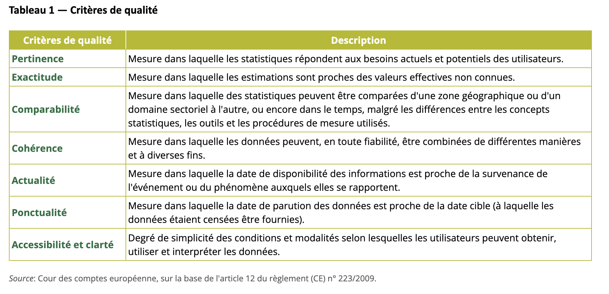
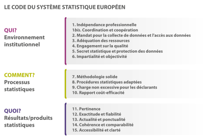

```{r, echo=FALSE}
library(metathis)
meta() %>% 
  meta_description(params$event) %>% 
  meta_name("github-repo" = paste0("datactivist/", params$slug)) %>% 
  meta_viewport() %>% 
  meta_social(
    title = params$title,
    url = paste0("https://datactivist.coop/", params$slug),
    image = params$image,
    image_alt = params$image_alt,
    og_type = "website",
    og_author = "Datactivist",
    og_locale = "fr_FR",
    og_site_name = "Datactivist",
    twitter_card_type = "summary",
    twitter_creator = "@datactivi_st")

```

layout: true

<style>
.remark-slide-number {
  position: inherit;
}

.remark-slide-number .progress-bar-container {
  position: absolute;
  bottom: 0;
  height: 4px;
  display: block;
  left: 0;
  right: 0;
}

.remark-slide-number .progress-bar {
  height: 100%;
  background-color: #e95459;
}

</style>


`r paste0("<div class='my-footer'><span>", params$event, "</span> <center><div class=logo><a href='https://datactivist.coop/'></a></div></center></span></div>")` 


---

class: center, middle

Ces slides en ligne : https://samgoeta.github.io/strategic-data/4/

Sources : https://github.com/samgoeta/strategic-data/


Les productions de Datactivist sont librement réutilisables selon les termes de la licence [Creative Commons 4.0 BY-SA](https://creativecommons.org/licenses/by-sa/4.0/legalcode.fr).

<BR>
<BR>


---
### La qualité des données : .red[une notion à prendre avec des pincettes]

- Les données de qualité des uns sont les mauvaises données des autres. 

- Il y a de bonnes "raisons organisationnelles d'avoir de mauvaises données."

- La qualité dépend de l'usage qui est fait des données. Si elles sortent de leur contexte de production, la qualité devient très relative. 


---
### La qualité : une construction sociale .red[récente]

  
- **Origine statistique de la qualité :**
  - Edwards Deming aux USA développe dès les années 30 le contrôle statistique de la qualité. 
  - Dans les années 50, fait circuler la notion de qualité entre les USA et le Japon (toyotisme).

- **En statistique, une notion accélérée par la construction européenne :** 
  - Les statistiques nationales ont des conséquences pour les Etats membres : montant des cotisations au budget européen, subventions, Pacte de stabilité…
  - Attention portée à la qualité de ces chiffres, mieux vaut qu'ils soient fiables…

.red[.footnote[Desrosières, Alain. « Chapitre 6. Les qualités des quantités ». Gouverner par les nombres, Presses des Mines, 2008.]
]
---

### Les six critères de qualité de la statistique
Enfin, 7 si on ne fusionne pas actualité et ponctualité : 



.footnote[Source: [Cour des comptes européenne](https://op.europa.eu/webpub/eca/special-reports/european-statistics-26-2022/fr/), 2017.]

---
.red[D'autres versions plus récentes existent :] 


.footnote[Source: [Cour des comptes européenne](https://op.europa.eu/webpub/eca/special-reports/european-statistics-26-2022/fr/), 2017.]
---

### Les ambiguités de la .red[précision]

- S'inscrit dans une **épistémologie .red["réaliste"]** car on cherche à ce que le chiffre mesuré se rapproche d'une "vraie" valeur inconnue.

- Pour un indicateur comme le chômage, il y a de nombreux cas limites hors de la définition du BIT (sans travail, démarches, disponible) : petits boulots, arrêts maladies, formation…

- Les statisticiens sont tiraillés entre : 
  - **l'exigence professionnelle** d'exiger ses méthodes de manière quasi-constructiviste 
  - **la demande sociale de chiffres "réalistes"** légitimés par une institution indiscutables"

- Les bémols méthodologiques pourraient semer le doute. Ils disparaissent souvent avec les usages (résultats partiels).

.footnote[Source : Desrosières, Alain. « Chapitre 6. Les qualités des quantités ». Gouverner par les nombres, Presses des Mines, 2008]

---

### La comparabilité : un instrument de la .red[construction européenne]

- **Rappel :** les façons de penser la société et l'économie, les modes d'action publique et les statistiques s'entremêlent

- **Efforts d'harmonisation des statistiques à l'échelle européenne** depuis les années 80
  - au départ, harmonisation des **objets étudiés** (données en _outputs_)
  - de plus en plus, harmonisation des **méthodes** (données en _inputs_)

.red[**Si la statistique est la science de l'Etat, l'harmonisation européenne des statistiques est un moyen de participer à l'unification administrative du continent… à bas bruit🤫**]

---
class:inverse, center, middle

### .red[En conclusion]

### Les statisticiens appliquent de nombreuses normes pour qualifier et la fiabilité de leurs données

---
class:inverse, center, middle

### .red[Mais nous, on fait comment ?]
--

### Comment savoir si un chiffre est fiable ?

---
### La difficulté (rappel) : la réification des chiffres


> Une fois les procédures de quantification codifiées et routinisées, leurs produits sont réifiés. Ils tendent à devenir « la réalité », par un effet de cliquet irréversible. Les conventions initiales sont oubliées, l’objet quantifié est comme naturalisé et l’emploi du verbe « mesurer » vient machinalement à l’esprit et sous la plume. 

.footnote[Desrosières, Alain. Pour une sociologie historique de la quantification. Presses des Mines, 2008, https://doi-org.lama.univ-amu.fr/10.4000/books.pressesmines.901.
]

---
### La difficulté (rappel) : la réification des chiffres


> Une fois les procédures de quantification codifiées et routinisées, leurs produits sont réifiés. Ils tendent à devenir « la réalité », par un effet de cliquet irréversible. Les conventions initiales sont oubliées, l’objet quantifié est comme naturalisé et l’emploi du verbe « mesurer » vient machinalement à l’esprit et sous la plume. 

Alain Desrosières

.footnote[Desrosières, Alain. Pour une sociologie historique de la quantification. Presses des Mines, 2008, https://doi-org.lama.univ-amu.fr/10.4000/books.pressesmines.901.
]
---
### La difficulté (rappel) : la réification des chiffres

.pull-left[

> « Décidément, on ne devrait jamais parler de “données”, mais toujours **d’ “obtenues”.** »

Bruno Latour, 1993
]
--
.pull-right[


> "L’enjeu principal, il me semble, une fois que l’on admet que les données sont toujours des « obtenues » comme le disait Bruno Latour (…), c’est de comprendre **dans quelles conditions elles deviennent malgré tout des « données » pour certains.**"

Jérôme Denis, 2018, dans son entretien avec Nonfiction
]

---
class:inverse, middle, center

## Les questions à se poser devant un chiffre

---
### 3 questions basiques

.left-column[


>   
> "Toutes les statistiques sont imparfaites, mais certaines le sont beaucoup moins que d'autres."

.footnote[Joel Best, _Damned Lies and Statistics_, 2001. Source : [Greenriver college](https://libguides.greenriver.edu/c.php?g=179914&p=8974008).]
]
.right-column[
#### 1. .red[Qui] a créé cette statistique ? 

- Qui sont les auteurs de ce chiffre ?
- Quelle institution les emploie ? Peut-on se fier à cette institution ? Comment le sait-on ?


#### 2. .red[Pourquoi] cette statistique a-t-elle été créée ? 
- Quelle est la motivation des auteurs ? 
- Utilisent-ils les chiffres à des fins de persuasion ?

#### 3. .red[Comment] cette statistique a-t-elle été créée ?
- Comment sont-ils parvenus à cette statistique ? 
]

---
### La méthode .red[SMART] pour vérifier un chiffre

- **.red[S]ource :** Qui ou quelle est la source qui vous a mené à ce chiffre ?

- **.red[M]otivation :** Pourquoi le disent-ils ?

- **.red[A]utorité :** Qui a produit les données/statistiques ?

- ** .red[R]éexamen (_review_) :** Examinez attentivement les méthodes de collecte et l'exhaustivité des données.

- ** .red[T]est des deux sources :** Vérifiez tout deux fois si possible.

.footnote[University of Washington Library, "[Savvy Info Consumers: Data & Statistics](https://guides.lib.uw.edu/research/evaluate/data"]

---
class:inverse, middle,center

### A vous de jouer
---

class: inverse, center, middle

# Merci !

Contact : [samuel.goeta@sciencespo-aix.fr](mailto:samuel.goeta@sciencespo-aix.fr)


